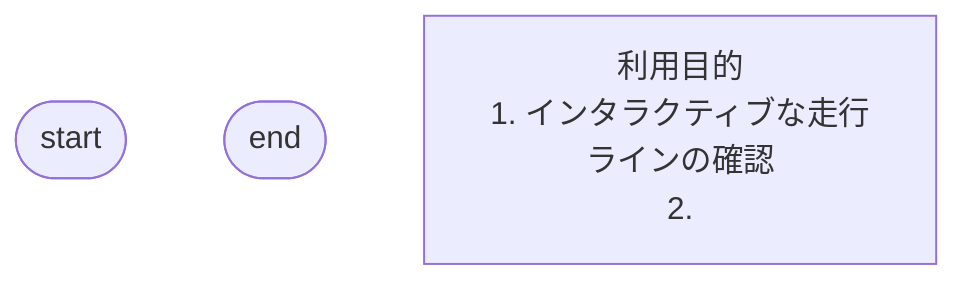

# iR Video Tracker

このツールを使うことでiRacingのリプレイ映像から走行データ(走行ライン、速度、ヨー角など)を取得できます。  
次のような活用法が期待されます。

- telemetryを取り忘れたラップの分析をしたい。
- 手元にtelemetryデータのないライバルの走りを分析したい。

## Getting Started

### Prerequisites

- MATLAB
  - Computer Vision Toolbox
  - Image Processing Toolbox
  - MatlabProgressBar
  - matmap3d

### Installing

```bash
git clone https://github.com/Sintaku73/ir-video-tracker.git
```

## Usage and Examples



## Deployment


## Built With


## Contributing


## Versioning


## Authors


## License


## Acknowledgments


