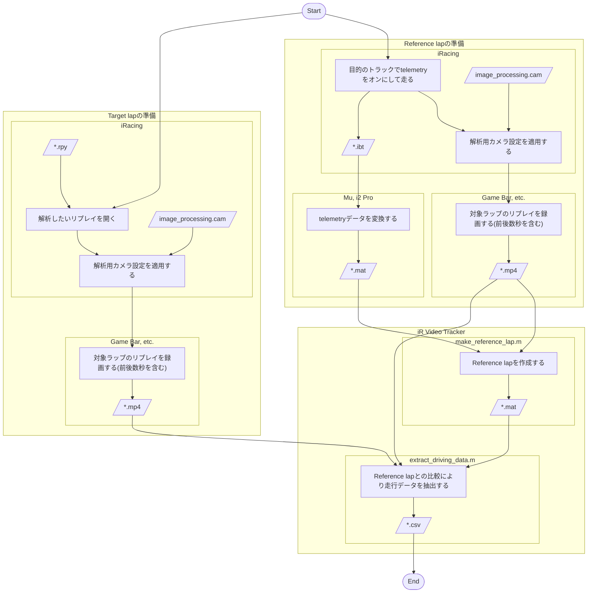
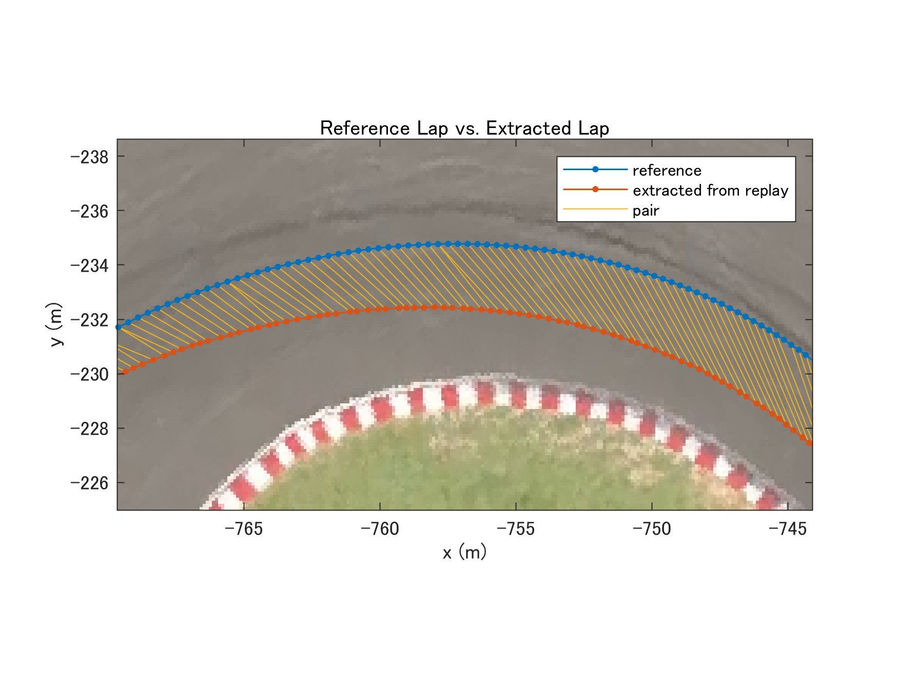

# iR Video Tracker

特徴点マッチング[^fm]を用いた画像解析によって、iRacingのリプレイ映像から走行データ(走行ライン、速度、ヨー角など)を取得できます。  
次のような活用法が期待されます。

- telemetryを取り忘れたラップの分析をしたい。
- 手元にtelemetryデータのないライバルの走りを分析したい。

https://github.com/user-attachments/assets/6edf4f84-939c-4b20-92a4-c139eca2fdd9

## Getting Started

### Prerequisites

- [MATLAB](https://www.mathworks.com/products/matlab.html)
  - [Computer Vision Toolbox](https://www.mathworks.com/products/computer-vision.html)
  - [Image Processing Toolbox](https://www.mathworks.com/products/image-processing.html)
  - [MatlabProgressBar](https://www.mathworks.com/matlabcentral/fileexchange/57895-matlabprogressbar)
  - [matmap3d](https://www.mathworks.com/matlabcentral/fileexchange/68480-matmap3d)

### Installing

```bash
git clone https://github.com/Sintaku73/ir-video-tracker.git
```

## Usage and Examples

このツールの使い方は下記フローチャートの通りです:



### make_reference_lap.m

リプレイ映像、telemetryデータ[^mu]からトラックマップを生成します。
生成されたデータは`extract_driving.m`でも使用されます。

### extract_driving_data.m

対象ラップのリプレイを`extract_driving_data.m`の出力データと比較することで、対象ラップのtelemetyデータなしに走行データの抽出します。  
出力されるCSVファイルはSteven Daniluk氏の[MotecLogGenerator](https://github.com/stevendaniluk/MotecLogGenerator.git)[^motec]を用いることでi2 Proで読み込める形式に変換できます。



## License

This project is licensed under the MIT License - see the [LICENSE](LICENSE) file for details.

## References

[^fm]: [Automatically Find Image Rotation and Scale](https://www.mathworks.com/help/vision/ug/find-image-rotation-and-scale-using-automated-feature-matching.html)  
    特徴点マッチングについてはこちらのサンプルを参考にしました。
[^mu]: [Mu - Telemetry Exporter for iRacing](https://github.com/patrickmoore/Mu)  
    iRacingで得られたibtファイルの変換に使用しました。
[^motec]: [MotecLogGenerator](https://github.com/stevendaniluk/MotecLogGenerator)  
    [Accessport形式](https://github.com/stevendaniluk/MotecLogGenerator#accessport-logs)での変換に対応しています。
